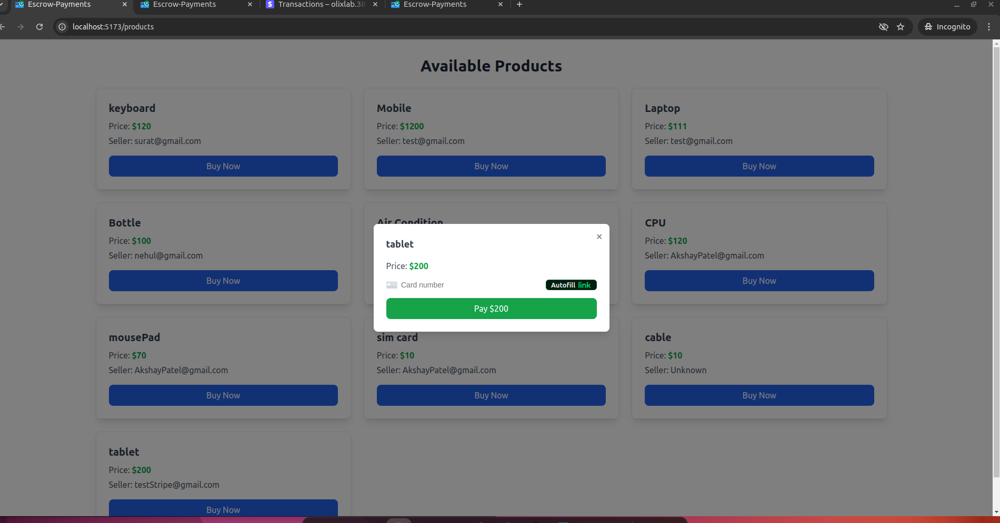

# Escrow Payment Platform
## Introduction
This web application provides a secure platform for processing escrow payments. It allows buyers to make payments that are held for 2 days before being released to sellers. The platform ensures trust between buyers and sellers by mediating payments securely.


---

## Tech Stack
- **Frontend:** React, Tailwind CSS
- **Backend:** Node.js, Express.js
- **Database:** MongoDB
- **Payments:** Stripe API
- **Authentication:** JSON Web Tokens (JWT)

---

## Installation

### Prerequisites
- Node.js and npm installed
- MongoDB database
- Stripe account

### Steps
#### Clone the repository:
```
   git clone https://github.com/mytechworker/escrow-payment-platform.git
   cd escrow-payment-platform
```
#### Install dependencies:
#### For Frontend :
```
cd frontend
npm install 
```
#### For Backend :
```
cd backend
npm install 
```

#### Set up environment variables: Create a .env file in the root directory with the following keys:
```
SESSION_SECRET=your-session-secret
STRIPESECRETKEY=your-stripe-secret-key
DATABASE_URL=your-mongodb-connection-url
```

#### Run the application:
- for Frontend :  
```
npm run dev
```
- for Backend : 
```
npm run start
```


Access the application at **http://localhost:5173** .

## Demo Video

#### Watch the video walkthrough to see the platform in action:

[](./assets/stripeConnectDemo.mp4)

> Click the above image or [download the demo video](./assets/stripeConnectDemo.mp4) to see the application in action.


## Screenshots
### Buyer Dashboard


### Seller Dashboard

